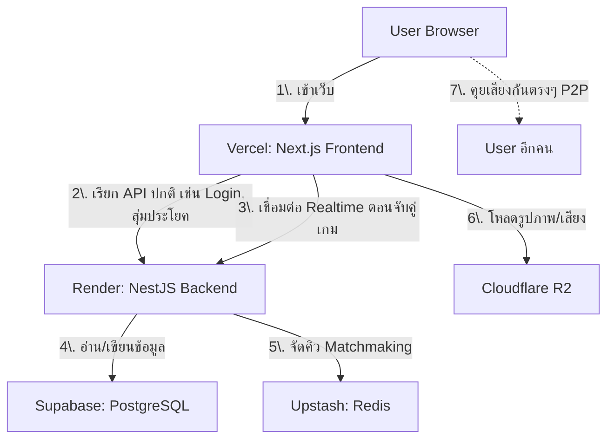
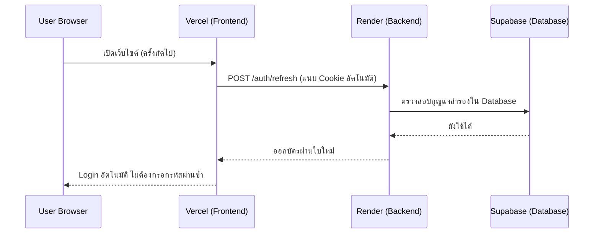
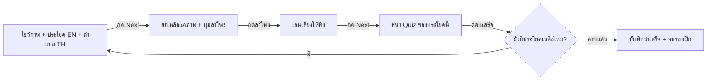
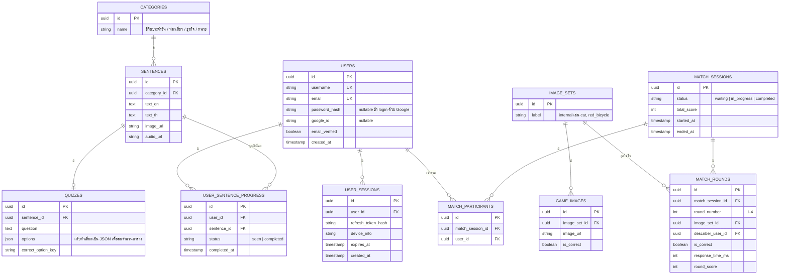

# Developer Manual — Language Learning Platform
### (ฉบับปรับปรุง: เน้น Free-tier เป็นอันดับแรก + Deploy บน Vercel)

> เอกสารนี้เป็น Manual สำหรับ Programmer เพื่อทำความเข้าใจสถาปัตยกรรม, โครงสร้างไฟล์, Database, และความปลอดภัยของเว็บไซต์ฝึกภาษา เขียนโดยพยายามอธิบายด้วยภาษาที่เข้าใจง่าย ไม่ใช้ศัพท์เทคนิคลอยๆ โดยไม่อธิบาย

---

## 0. หลักการของเวอร์ชันนี้

1. **ทุกบริการที่เลือกใช้ ให้ใช้ Free-tier (แผนฟรี) ก่อนเป็นอันดับแรก** ถ้าบริการไหนไม่มีแผนฟรีที่ใช้งานได้จริง จะ **ทำเครื่องหมาย 🔴 ไว้ชัดเจน** พร้อมบอกว่าทำไมถึงฟรีไม่ได้ และมีทางเลือกอะไรบ้าง
2. **เว็บไซต์หลัก (Frontend) จะ Deploy บน Vercel เป็นที่แรก** เพราะ Vercel ฟรีสำหรับโปรเจกต์เริ่มต้น และรองรับ Next.js ได้ดีที่สุด (เป็นเจ้าของ Next.js เอง)
3. ส่วนไหนที่ Vercel ทำไม่ได้ (เช่น การเชื่อมต่อค้างไว้ตลอดเวลาแบบ Realtime) จะแยกไปใช้บริการฟรีอื่นที่เหมาะกับงานนั้นแทน

---

## 1. ก่อนอื่น: อธิบายภาพรวมง่ายๆ

ลองนึกภาพเว็บไซต์เป็นร้านอาหารร้านหนึ่ง:

- **Frontend** = หน้าร้าน/เมนูที่ลูกค้าเห็นและสั่งอาหาร (สิ่งที่ User เห็นบนจอ)
- **Backend** = ห้องครัว ที่รับออเดอร์จากหน้าร้านไปประมวลผล (ตรวจรหัสผ่าน, สุ่มประโยค, คิดคะแนนเกม ฯลฯ)
- **Database** = ตู้เก็บวัตถุดิบ/สูตรอาหาร (เก็บข้อมูล User, ประโยค, คะแนน)
- **Realtime Server** = พนักงานที่วิ่งไปมาระหว่างโต๊ะแบบสดๆ (ใช้ตอนจับคู่ผู้เล่นและระหว่างเล่นเกมพร้อมกัน)

---

## 2. สรุป Functional Requirements (เหมือนเดิม)

| # | ฟีเจอร์ | สรุปสั้น |
|---|---|---|
| 1 | Authentication | Username/Password + ยืนยัน Email, Login with Google, จดจำการ Login |
| 2 | ระบบฝึกพูด | เลือกหมวด (4 หมวด) → เลือกฝึกใหม่/เก่า → สุ่มประโยคตาม Rule → ภาพ+คำแปล → ฟังเสียง → Quiz |
| 3 | Minigame จับคู่ Real-time | จับคู่ 2 คน → คุยด้วยเสียง → เกมทายภาพ 4 รอบ สลับบทบาท → คิดคะแนนตามความเร็ว |
| NF1 | Responsive | Desktop + Mobile |
| NF2 | Security | ป้องกัน Unauthorized Access |

---

## 3. ตารางสรุป: อะไรฟรี อะไรไม่ฟรี (สำคัญที่สุด อ่านก่อนตัดสินใจ)

| บริการ | ใช้ทำอะไร (แปลภาษาง่ายๆ) | Free-tier ที่แนะนำ | ฟรีได้แค่ไหน / ข้อจำกัด |
|---|---|---|---|
| **Vercel** | ที่อยู่ของหน้าเว็บ (Frontend) | ✅ Vercel Hobby Plan | ฟรีสำหรับโปรเจกต์ส่วนตัว/เริ่มต้น มี Limit เรื่องเวลาที่ฟังก์ชันรันได้สูงสุด (10 วินาที/ครั้ง) และ Bandwidth ต่อเดือน |
| **Database (PostgreSQL)** | ตู้เก็บข้อมูล User/ประโยค/คะแนน | ✅ Supabase Free หรือ Neon Free | ฟรีให้พื้นที่เก็บข้อมูลประมาณ 500MB (Supabase) ⚠️ Supabase Free จะ "พัก" โปรเจกต์อัตโนมัติถ้าไม่มีใครเข้าใช้เกิน 7 วัน (ต้องกดปลุกเอง) |
| **Redis (คิว/แคช)** | ใช้จัดคิว Matchmaking และช่วยให้ระบบเร็วขึ้น | ✅ Upstash Redis Free | ฟรีจำกัดจำนวนคำสั่งต่อวัน (ประมาณ 10,000 คำสั่ง/วัน) พอสำหรับช่วงเริ่มต้น |
| **Realtime Server (Socket.io)** | พนักงานวิ่งข้อความสดๆ ตอนจับคู่และเล่นเกม | ✅ Render Free Web Service | ⚠️ ฟรีแต่ถ้าไม่มีคนใช้ 15 นาที ระบบจะ "หลับ" พอมีคนเข้าใช้ครั้งแรกจะช้า (Cold Start) ~30-50 วินาที — Vercel เองรองรับ Connection ค้างแบบนี้ไม่ได้ ต้องแยกไปโฮสต์ที่นี่ |
| **File/รูปภาพ/เสียง** | เก็บไฟล์รูปประกอบประโยค, เสียง, รูปในเกม | ✅ Cloudflare R2 Free | ฟรี 10GB และไม่คิดค่า Bandwidth ขาออก (ข้อดีกว่า AWS S3 มาก) |
| **TURN Server** | ตัวช่วยให้คุยเสียงกันติดตอนเน็ตมีปัญหา | ✅ Open Relay Project / Metered.ca Free | ฟรีแบบจำกัด Bandwidth ต่อเดือน ใช้ได้เฉพาะกรณีที่เชื่อมตรงไม่ได้เท่านั้น (ส่วนใหญ่ไม่จำเป็นต้องใช้เลย) |
| **ส่ง Email ยืนยัน** | ส่ง Email ตอนสมัครสมาชิก | ✅ Resend Free หรือ SendGrid Free | ฟรีส่งได้ประมาณ 100-3,000 ฉบับ/เดือน เพียงพอมากสำหรับช่วงเริ่มต้น |
| **Google OAuth** | Login ด้วย Google | ✅ ฟรีเสมอ | Google ไม่คิดเงินการใช้ OAuth Login |
| **🔴 Speech-to-Text** (แปลงเสียงพูดเป็นข้อความ) | ใช้ตรวจคำตอบในโหมด Mock และ (Optional) ให้คะแนนการออกเสียง | ⚠️ **ไม่มี Free-tier ที่ใช้งานจริงได้ฟรีถาวร** | Google STT ให้ฟรีแค่ 60 นาที/เดือนแรกเท่านั้น (Whisper API ของ OpenAI ไม่มีฟรีเลย คิดตามนาทีตั้งแต่นาทีแรก) → นี่คือจุดเดียวที่ "หนีค่าใช้จ่ายไม่พ้น" ถ้าจะใช้งานจริงจัง |

### สรุปง่ายๆ

> **ทุกอย่างในระบบสามารถเริ่มต้นแบบฟรี 100% ได้ ยกเว้นจุดเดียวคือ "การแปลงเสียงพูดเป็นข้อความ" (Speech-to-Text)** ซึ่งเป็นหัวใจของโหมด Mock และโหมดฝึกพูด — แนะนำให้ **เริ่ม Develop/ทดสอบด้วย Google STT Free 60 นาทีแรกไปก่อน** แล้วค่อยประเมินงบประมาณจริงตอนจะเปิดให้คนทั่วไปใช้งาน (เพราะจุดนี้จ่ายตามการใช้งานจริง ควบคุมได้)

---

## 4. Tech Stack (อัปเดตให้เข้ากับ Free-tier First + Deploy บน Vercel)

| Layer | เทคโนโลยี | อธิบายง่ายๆ | Deploy ที่ไหน |
|---|---|---|---|
| **Frontend** | Next.js (React) + TypeScript | หน้าเว็บทั้งหมดที่ User เห็นและกด | 🚀 **Vercel (Free)** |
| Styling | Tailwind CSS | ตัวช่วยจัดหน้าตาเว็บให้สวยและ Responsive โดยไม่ต้องเขียน CSS เยอะ | อยู่ในโปรเจกต์เดียวกับ Frontend |
| Client State | Zustand + TanStack Query | ตัวช่วยจำข้อมูลฝั่ง Browser และดึงข้อมูลจาก Backend มาแสดง | อยู่ในโปรเจกต์เดียวกับ Frontend |
| **Backend (REST API)** | NestJS (Node.js + TypeScript) | ห้องครัวที่ประมวลผล Logic ทั้งหมด (Auth, สุ่มประโยค, คิดคะแนน) | 🚀 **Render Free Web Service** |
| **Realtime Server** | Socket.io (ฝังอยู่ใน NestJS ตัวเดียวกัน) | พนักงานที่วิ่งส่งข้อความสดๆ ตอนจับคู่ผู้เล่นและระหว่างเล่นเกม | อยู่ที่เดียวกับ Backend (Render) |
| Voice Call | WebRTC (ฟีเจอร์มาตรฐานของ Browser ไม่ต้องติดตั้งอะไรเพิ่ม) | ให้ User คุยเสียงกันตรงๆ ระหว่าง Browser โดยไม่ผ่าน Server (ประหยัดค่าใช้จ่ายมาก) | ทำงานฝั่ง Browser โดยตรง |
| ORM | Prisma | ตัวกลางที่ช่วยให้ Backend คุยกับ Database ได้ง่ายและปลอดภัย | อยู่ในโปรเจกต์ Backend |
| **Database** | PostgreSQL | ตู้เก็บข้อมูลหลักของระบบ | 🚀 **Supabase Free** |
| Cache/Queue | Redis | ตัวช่วยจัดคิวจับคู่ผู้เล่นให้เร็วขึ้น | 🚀 **Upstash Free** |
| Storage | Cloudflare R2 | เก็บไฟล์รูปภาพและเสียง | 🚀 **Cloudflare R2 Free** |
| Voice Infra | STUN/TURN | ตัวช่วยให้ WebRTC เชื่อมต่อกันได้แม้เน็ตมีปัญหา | 🚀 **Open Relay Project Free** |
| Auth | Passport.js | ตัวช่วยตรวจสอบรหัสผ่านและ Login ด้วย Google | อยู่ในโปรเจกต์ Backend |
| Email | Resend / SendGrid | ส่ง Email ยืนยันตัวตน | 🚀 **Free-tier** |
| **🔴 Speech-to-Text** | Google Speech-to-Text | แปลงเสียงพูดของ User เป็นข้อความเพื่อตรวจคำตอบ | ฟรีแค่ 60 นาทีแรก หลังจากนั้นมีค่าใช้จ่าย |

---

## 5. แผนการ Deploy (Deployment Plan)

เพราะ Vercel ถูกออกแบบมาสำหรับ Frontend และงานที่ "ทำเสร็จเร็วแล้วจบ" (Serverless) มันจึง **รองรับการเชื่อมต่อค้างสายตลอดเวลาแบบ Socket.io ไม่ได้** — นี่คือเหตุผลที่ต้องแยก Backend ที่มี Realtime ไปอยู่อีกที่หนึ่ง (Render) แทนที่จะยัดทุกอย่างไว้ใน Vercel ที่เดียว



### ขั้นตอน Deploy แนะนำ (เรียงตามลำดับที่ควรทำ)

1. **Deploy Frontend บน Vercel ก่อน** — แม้ Backend ยังไม่เสร็จ ก็ Deploy หน้าเว็บเปล่าๆ ขึ้นไปได้เลย เพื่อให้มี Link ทดสอบ/โชว์งานได้ทันที (Vercel เชื่อมกับ GitHub ได้ Push โค้ดแล้ว Deploy อัตโนมัติ)
2. **ตั้งค่า Supabase (Database) และ Upstash (Redis)** — สมัครฟรี สร้าง Connection String มาใส่ใน Backend
3. **Deploy Backend บน Render Free Web Service**
4. **เชื่อม Frontend เข้ากับ Backend** ผ่าน Environment Variable (URL ของ Backend) ใน Vercel
5. **ค่อยเพิ่ม Speech-to-Text ทีหลังสุด** เพราะเป็นจุดเดียวที่มีค่าใช้จ่าย ควรทำให้ระบบอื่นเสร็จและทดสอบให้มั่นใจก่อน

---

## 6. โครงสร้างโปรเจกต์ (Project Structure)

```
/apps
  /web                          # Next.js Frontend (Deploy → Vercel)
    /app
      /(auth)/login/page.tsx        # หน้า Login
      /(auth)/register/page.tsx     # หน้าสมัครสมาชิก
      /(auth)/verify-email/page.tsx # หน้ายืนยัน Email หลังคลิก Link
      /practice/select/page.tsx     # เลือกหมวด + เลือกฝึกใหม่/เก่า + จำนวนประโยค
      /practice/[sessionId]/page.tsx# หน้าฝึกพูด (ภาพ → เสียง → Quiz)
      /game/lobby/page.tsx          # หน้ากดเริ่มจับคู่ + ขอ Permission ไมค์
      /game/[matchId]/page.tsx      # หน้าเล่นเกมจริง (4 รอบ)
      /game/[matchId]/summary/page.tsx # หน้าสรุปคะแนน
      /(protected)/layout.tsx       # Layout ที่เช็ค Auth ก่อนเข้าเนื้อหา
    /components                   # UI Components ที่ใช้ซ้ำ
    /hooks
      useAuth.ts                    # เช็คสถานะ Login / Refresh Token อัตโนมัติ
      useSocket.ts                  # เชื่อมต่อ Socket.io ไปหา Backend บน Render
      useWebRTC.ts                  # จัดการการคุยเสียง + ปุ่มเปิด/ปิดไมค์
    /lib
      api-client.ts                 # ตัวเรียก API ที่แนบ Token อัตโนมัติ
      socket-client.ts              # ตัวเชื่อมต่อ Socket.io กลาง

  /api                            # NestJS Backend (Deploy → Render)
    /src
      /auth                        # ตรวจรหัสผ่าน, ออก Token, ส่ง Email, Google Login
      /users
      /sentences                   # ดึงหมวดและประโยค
      /practice                    # Logic สุ่มประโยคใหม่/เก่า
      /game                        # Logic คิดคะแนน, เลือกชุดภาพ
      /realtime                    # Socket.io Gateway (Matchmaking + WebRTC Signaling + เกม)
      /common                      # Guard/Interceptor/Filter ที่ใช้ร่วมกัน
      /prisma
        schema.prisma                # นิยาม Database Schema
      main.ts
```

---

## 7. Flow การทำงานของแต่ละฟีเจอร์

### 7.1 Authentication + การจดจำการ Login (Session Cookie)

พูดง่ายๆ คือ: เราไม่อยากให้ User ต้อง Login ใหม่ทุกครั้งที่เข้าเว็บ เลยแจก "บัตรผ่านชั่วคราว" (Access Token) ที่หมดอายุเร็ว (~15 นาที) และแอบเก็บ "กุญแจสำรอง" (Refresh Token) ไว้ในคุกกี้แบบที่ JavaScript แตะไม่ได้ (httpOnly Cookie) เพื่อความปลอดภัย — พอบัตรผ่านหมดอายุ ระบบจะใช้กุญแจสำรองไปขอบัตรใหม่ให้อัตโนมัติแบบเงียบๆ โดย User ไม่รู้ตัว



- สมัครสมาชิก: เก็บรหัสผ่านแบบเข้ารหัส (ไม่เก็บ Plain Text เด็ดขาด) + ส่ง Email ยืนยัน
- Login ด้วย Google: ถ้าไม่เคยมีบัญชี ระบบสร้างให้อัตโนมัติ (ไม่ต้องยืนยัน Email ซ้ำ เพราะ Google ยืนยันมาให้แล้ว)

### 7.2 ระบบฝึกพูด (Sentence Practice)

**Logic การสุ่มประโยค** (พูดง่ายๆ):

```
ถ้า User ไม่เคยฝึกประโยคในหมวดนี้มาก่อนเลย
    → สุ่มประโยคใหม่ทั้งหมดให้

ถ้าเลือก "3 ประโยค"
    → สุ่ม 2 ประโยคใหม่ + สุ่ม 1 ประโยคเก่าที่เคยฝึกแล้ว

ถ้าเลือก "2 ประโยค"
    → สุ่ม 1 ประโยคใหม่ + สุ่ม 1 ประโยคเก่า
```

⚠️ ประโยคจะถูกนับว่า "เก่า" ก็ต่อเมื่อ User เล่นจน Quiz ของประโยคนั้นเสร็จสมบูรณ์เท่านั้น ถ้าเล่นค้างกลางทางจะยังนับเป็น "ยังไม่เก่า"

**หน้าฝึกพูด** วนแบบนี้ทีละประโยคจนครบ:



### 7.3 Minigame จับคู่ Real-time

**ขั้นที่ 1 — จับคู่ผู้เล่น** (เหมือนต่อคิวเข้าห้อง): ใครกดปุ่ม "เริ่ม" ใกล้เคียงกัน ระบบจะจับคู่ให้อัตโนมัติผ่าน Redis (Upstash)

**ขั้นที่ 2 — คุยเสียงกัน**: ใช้ WebRTC ซึ่งเสียงจะวิ่งตรงระหว่าง Browser ของทั้งคู่เลย **ไม่ผ่าน Server** (ข้อดีคือ Server ไม่ต้องแบกภาระและไม่มีค่าใช้จ่ายส่วนนี้) Backend ทำหน้าที่แค่ช่วย "แนะนำตัว" ให้สองฝั่งรู้จักกันตอนแรกเท่านั้น

**ขั้นที่ 3 — เล่นเกมทายภาพ**: 4 รอบ สลับกันเป็นคนอธิบาย/คนทาย

**สูตรคะแนน** (ยิ่งตอบไวยิ่งได้เยอะ อธิบายง่ายๆ คือ "นาฬิกาจับเวลาเริ่มเดินตั้งแต่เห็นตัวเลือก ยิ่งกดตอบเร็วเท่าไหร่ คะแนนยิ่งเหลือเยอะเท่านั้น"):

```
คะแนนเต็มต่อรอบ = 100 คะแนน
เวลาสูงสุดที่ให้ตอบ = 30 วินาที

ถ้าตอบผิด หรือหมดเวลา → ได้ 0 คะแนน
ถ้าตอบถูก:
    คะแนน = 100 × (1 − เวลาที่ใช้ตอบ ÷ 30)
    แต่ถ้าตอบถูกแม้จะช้า ยังได้คะแนนขั้นต่ำ 10 คะแนน (กันไม่ให้ได้ 0 ทั้งที่ตอบถูก)

คะแนนรวมทั้ง Match = บวกคะแนนทั้ง 4 รอบ
```

⚠️ **จุดสำคัญด้านความปลอดภัย**: ฝั่งคนทายจะไม่มีทางรู้ล่วงหน้าว่าภาพไหนคือคำตอบที่ถูก (Server เป็นคนตรวจให้เท่านั้น) และเวลาที่ใช้คำนวณคะแนนก็นับที่ Server ไม่ใช่ที่เครื่อง User เพื่อป้องกันการโกง

---

## 8. Database Design (ER Diagram)

ออกแบบให้มีเท่าที่จำเป็น ไม่เพิ่มตารางเกินความจำเป็น เพื่อให้ดูแลรักษาง่าย



---

## 9. มาตรการความปลอดภัย (Security Checklist)

| หมวด | มาตรการ | อธิบายง่ายๆ |
|---|---|---|
| Password | เข้ารหัสด้วย argon2 | เหมือนใส่กุญแจแน่นหนาให้รหัสผ่าน ไม่เก็บตัวจริงไว้เลย |
| Token | Access Token อายุสั้น เก็บใน Memory เท่านั้น | ไม่เก็บใน localStorage เพราะถ้าเว็บโดนแฮกผ่าน Script แปลกปลอม จะขโมย Token ไปใช้ไม่ได้ |
| Refresh Token | เก็บใน httpOnly Cookie + หมุนรหัสใหม่ทุกครั้งที่ใช้ | เหมือนกุญแจสำรองที่ซ่อนไว้ในตู้เซฟที่ JavaScript แตะต้องไม่ได้ |
| CSRF | มีการตรวจสอบเพิ่มเติมสำหรับ Request ที่เปลี่ยนแปลงข้อมูล | ป้องกันเว็บอื่นแอบส่งคำสั่งมาทำธุรกรรมแทน User โดยที่ User ไม่รู้ตัว |
| กัน Brute-force | จำกัดจำนวนครั้งที่ Login ผิดได้ต่อนาที | เหมือนล็อกประตูชั่วคราวถ้ามีคนลองรหัสผิดถี่ๆ |
| ตรวจ Input | ทุก Endpoint ตรวจรูปแบบข้อมูลก่อนใช้งานเสมอ | กันไม่ให้มีคนส่งข้อมูลแปลกปลอมเข้ามาทำลายระบบ |
| SQL Injection | ใช้ Prisma (ป้องกันอัตโนมัติ) | เหมือนใช้แบบฟอร์มมาตรฐานแทนการเขียนคำสั่งเองมือ ลดโอกาสพลาด |
| Authorization | ตรวจทุกครั้งว่า User เป็นเจ้าของข้อมูลจริง | กันไม่ให้ User คนหนึ่งไปเห็นข้อมูลของอีกคนได้ |
| CORS | จำกัด Origin เฉพาะ Domain ของเว็บเราเอง | กันเว็บอื่นแอบเรียก API ของเราไปใช้ |
| Game Fairness | คำตอบที่ถูกและเวลาคิดคะแนน คำนวณที่ Server เท่านั้น | กันคนเก่งคอมพิวเตอร์แอบดูคำตอบผ่าน Network แล้วโกง |
| WebRTC | ต้อง Login ก่อนถึงจะเชื่อมต่อ Realtime ได้ | กันคนแปลกหน้าแอบเข้ามาฟังหรือยุ่งกับ Match ของคนอื่น |
| Microphone | ขอ Permission ผ่าน Browser มาตรฐาน ไม่มีการอัดเก็บเสียงไว้ที่ Server | เสียงวิ่งตรงระหว่าง User สองคน ไม่ผ่าน Server เลย |
| Secrets | เก็บผ่าน Environment Variables เท่านั้น | ห้ามเผลอ Push รหัสลับ/API Key ขึ้น GitHub เด็ดขาด |

---

## 10. Non-Functional: Responsive

ใช้ Tailwind CSS ออกแบบแบบ Mobile-first (ออกแบบให้ใช้งานบนมือถือลื่นก่อน แล้วค่อยขยายจอให้สวยขึ้นบน Desktop) โดยเฉพาะหน้าเกมและหน้าฝึกพูดที่ต้องกดปุ่มง่ายด้วยนิ้วโป้งบนมือถือ

---

## 11. คำศัพท์น่ารู้ (Glossary แบบเข้าใจง่าย)

| คำศัพท์ | ความหมายง่ายๆ |
|---|---|
| Frontend | ส่วนที่ User มองเห็นและกดใช้งานบนจอ |
| Backend | ส่วนที่ทำงานเบื้องหลัง ประมวลผล Logic ต่างๆ ที่ User มองไม่เห็น |
| API | "ช่องทาง" ที่ Frontend ใช้คุยขอข้อมูลจาก Backend |
| Database | ที่เก็บข้อมูลถาวร (เหมือนตู้เก็บเอกสาร) |
| Token | "บัตรผ่าน" ชั่วคราวที่พิสูจน์ว่า User ตัวนี้ Login แล้วจริง |
| Cookie | ไฟล์เล็กๆ ที่เว็บฝากไว้ใน Browser ของ User เพื่อจำข้อมูลบางอย่าง |
| Realtime | การสื่อสารแบบสดๆ ทันที ไม่ต้องรีเฟรชหน้าเว็บ |
| WebRTC | เทคโนโลยีที่ให้ Browser สองเครื่องคุยเสียง/วิดีโอกันได้ตรงๆ โดยไม่ผ่าน Server |
| Serverless | รูปแบบ Server ที่ทำงานเฉพาะตอนมีคนเรียกใช้ ไม่ได้เปิดค้างไว้ตลอด (เช่น Vercel) — ประหยัด แต่เชื่อมต่อค้างสายแบบ Realtime ไม่ได้ |
| Cold Start | อาการที่ Server ซึ่ง "หลับ" อยู่ต้องใช้เวลาสักพักในการ "ตื่น" ตอนมีคนเข้าใช้ครั้งแรกหลังไม่มีคนใช้นาน |
| Free-tier | แผนการใช้งานฟรีที่บริการต่างๆ ให้มา มักมีข้อจำกัดเรื่องปริมาณการใช้งาน |

---

## 12. สรุป Endpoint หลัก (Reference)

| Method | Endpoint | หน้าที่ |
|---|---|---|
| POST | `/auth/register` | สมัครสมาชิก + ส่ง Email ยืนยัน |
| GET | `/auth/verify-email?token=` | ยืนยัน Email |
| POST | `/auth/login` | Login ด้วย Username/Password |
| GET | `/auth/google` | เริ่ม OAuth Flow กับ Google |
| POST | `/auth/refresh` | ขอบัตรผ่านใบใหม่จากกุญแจสำรอง |
| POST | `/auth/logout` | ลบ Session |
| GET | `/categories` | ดึงรายการหมวดฝึกพูด |
| POST | `/practice/session` | สร้าง Session สุ่มประโยคตาม Rule |
| POST | `/practice/session/:id/complete-sentence` | บันทึกว่าประโยคนี้เล่นจบแล้ว |
| Socket | `join_queue` / `matched` / `webrtc_signal` / `round_start` / `submit_answer` / `match_end` | Event ทั้งหมดของ Minigame |
| GET | `/game/summary/:matchId` | ดึงข้อมูลสรุปคะแนน |
